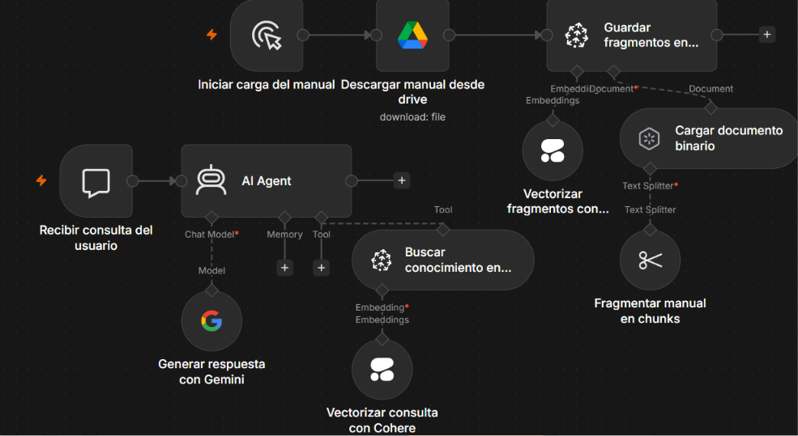
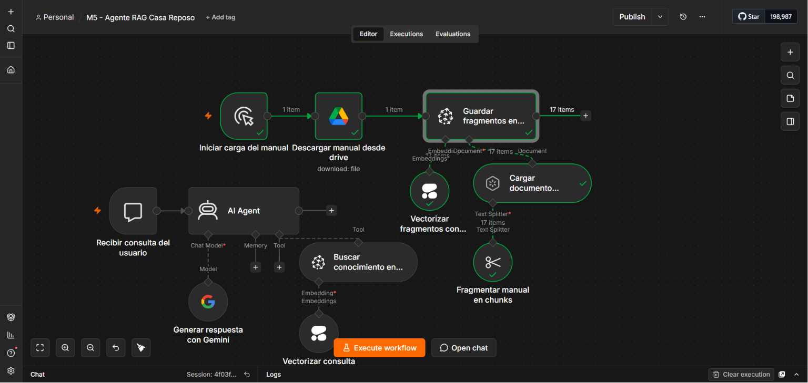
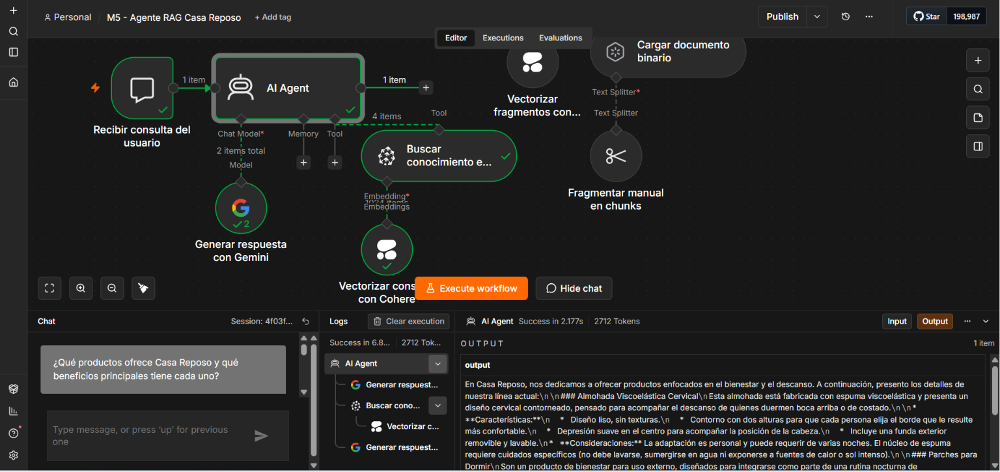
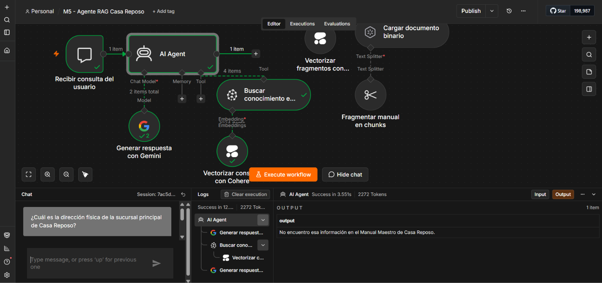

# Agente RAG para Casa Reposo

Proyecto desarrollado para el **Módulo 5 de AI Automation Avanzado de Coderhouse**.

El objetivo es implementar un agente conversacional con arquitectura RAG capaz de consultar el Manual Maestro de Conocimiento de Casa Reposo, recuperar información relevante y generar respuestas confiables sin inventar datos que no estén presentes en la documentación.

---

## Objetivo del proyecto

Construir en n8n un sistema de recuperación aumentada por generación que permita:

- Descargar el Manual Maestro desde Google Drive.
- Procesar y fragmentar el documento automáticamente.
- Generar embeddings multilingües.
- Almacenar el conocimiento en una base de datos vectorial.
- Recuperar los fragmentos más relevantes ante cada consulta.
- Generar respuestas alineadas con la información del manual.
- Evitar alucinaciones cuando la respuesta no se encuentra en la base de conocimiento.

---

## Arquitectura de la solución

El workflow está organizado en dos ramas independientes:

### 1. Ingesta de conocimiento

```text
Disparador manual
        ↓
Descarga del manual desde Google Drive
        ↓
Carga del documento binario
        ↓
Fragmentación del texto
        ↓
Generación de embeddings con Cohere
        ↓
Almacenamiento de vectores en Pinecone
```

Esta rama procesa el documento fuente y almacena su contenido como vectores semánticos reutilizables.

### 2. Consulta del agente RAG

```text
Consulta del usuario
        ↓
Agente RAG de Casa Reposo
        ↓
Vectorización de la consulta con Cohere
        ↓
Búsqueda semántica en Pinecone
        ↓
Recuperación de los fragmentos relevantes
        ↓
Generación de la respuesta con Gemini
```

El agente consulta la base vectorial antes de responder y utiliza exclusivamente la información recuperada del Manual Maestro.

---

## Tecnologías utilizadas

| Tecnología | Función |
|---|---|
| n8n | Orquestación de la automatización |
| Google Drive | Almacenamiento y descarga del documento fuente |
| Default Data Loader | Lectura del documento binario |
| Recursive Character Text Splitter | División del manual en fragmentos |
| Cohere Embed Multilingual v3.0 | Generación de embeddings de 1024 dimensiones |
| Pinecone | Almacenamiento y recuperación vectorial |
| Google Gemini | Generación de respuestas |
| GitHub | Documentación y entrega técnica del proyecto |

---

## Configuración técnica

### Fragmentación del documento

- **Chunk Size:** `1000`
- **Chunk Overlap:** `200`
- **Tipo de entrada:** `Binary`
- **Detección de formato:** automática mediante MIME Type
- **Método:** `Recursive Character Text Splitter`

El solapamiento permite conservar el contexto cuando una explicación queda dividida entre dos fragmentos.

### Embeddings e índice vectorial

- **Proveedor:** Cohere
- **Modelo:** `Embed-Multilingual-v3.0`
- **Dimensiones:** `1024`
- **Índice de Pinecone:** `casa-reposo-rag`
- **Tipo de vector:** denso
- **Métrica de similitud:** coseno
- **Infraestructura:** serverless
- **Región:** AWS `us-east-1`

El mismo modelo de embeddings se utiliza durante la ingesta y la consulta para garantizar la compatibilidad dimensional.

### Recuperación de conocimiento

- **Operación:** `Retrieve Documents (As Tool for AI Agent)`
- **Límite de resultados:** `4`
- **Metadata:** incluida
- **Reranking:** desactivado

---

## Funcionamiento del sistema

1. El workflow descarga el Manual Maestro desde Google Drive.
2. El documento se procesa como archivo binario.
3. El texto se divide en fragmentos con superposición.
4. Cohere transforma cada fragmento en un vector de 1024 dimensiones.
5. Pinecone almacena los vectores generados.
6. El usuario realiza una consulta desde el chat.
7. El agente utiliza Cohere para vectorizar la consulta.
8. Pinecone recupera los cuatro fragmentos semánticamente más relevantes.
9. Gemini redacta una respuesta basada en el conocimiento recuperado.
10. Si el manual no contiene la información solicitada, el agente lo comunica sin inventar datos.

---

## Control de alucinaciones

El mensaje de sistema establece las siguientes reglas para el agente:

- Consultar la base de conocimiento antes de responder.
- Utilizar únicamente información respaldada por el Manual Maestro.
- No completar datos faltantes con conocimientos externos.
- No inventar precios, políticas, características ni procedimientos.
- No revelar detalles técnicos internos de la arquitectura RAG.
- Mantener un tono profesional, cálido, claro y coherente con Casa Reposo.
- Reconocer expresamente cuando la información no está disponible.

Respuesta definida para información inexistente:

```text
No encuentro esa información en el Manual Maestro de Casa Reposo.
```

---

## Pruebas realizadas

### Consulta con información existente

Se consultó al agente sobre los productos de Casa Reposo y los beneficios principales de cada uno.

El sistema:

- Vectorizó la consulta con Cohere.
- Consultó la base vectorial de Pinecone.
- Recuperó cuatro fragmentos relevantes.
- Generó una respuesta coherente con el Manual Maestro.

### Prueba antialucinación

Se preguntó por la dirección física de la sucursal principal de Casa Reposo, dato inexistente en el Manual Maestro.

El agente respondió:

```text
No encuentro esa información en el Manual Maestro de Casa Reposo.
```

Esta prueba demuestra que el agente reconoce los límites de su base de conocimiento y evita generar información falsa.

---

## Resultados obtenidos

- Manual procesado correctamente.
- `17` fragmentos almacenados en Pinecone.
- Recuperación semántica validada.
- Generación de respuestas basada en contexto.
- Control antialucinación validado.
- Workflow ejecutado sin errores.
- Arquitectura reutilizable y adaptable a nuevos documentos.

---

## Evidencias de funcionamiento

### 1. Arquitectura completa

El workflow contiene una rama de ingesta del documento y otra destinada a la recuperación y generación de respuestas.



### 2. Ingesta del Manual Maestro

La ejecución procesó y almacenó correctamente `17 fragmentos` en Pinecone.



### 3. Consulta sobre productos y beneficios

El agente recuperó cuatro fragmentos relevantes y generó una respuesta basada en el Manual Maestro.



### 4. Prueba antialucinación

Ante una consulta cuya respuesta no estaba presente en el manual, el agente reconoció la falta de información y evitó inventar una dirección.



---

## Estructura del repositorio

```text
coderhouse-ai-automation-avanzado-modulo-5/
├── README.md
├── M5_Agente_RAG_Casa_Reposo.json
└── evidencias/
    ├── 01_arquitectura_completa.png
    ├── 02_ingesta_17_fragmentos.png
    ├── 03_consulta_productos.png
    └── 04_prueba_antialucinacion.png
```

---

## Importación del workflow

1. Descargar el archivo `M5_Agente_RAG_Casa_Reposo.json`.
2. Abrir n8n.
3. Seleccionar la opción para importar un workflow desde un archivo.
4. Elegir el JSON descargado.
5. Configurar credenciales propias para:
   - Google Drive OAuth2
   - Cohere
   - Pinecone
   - Google Gemini
6. Seleccionar un índice de Pinecone compatible con vectores de 1024 dimensiones.
7. Ejecutar primero la rama de ingesta.
8. Probar posteriormente las consultas desde el chat.

> Las claves de API, tokens, contraseñas y demás secretos no están incluidos en el repositorio.

---

## Archivo principal

El workflow completo y reutilizable está disponible en:

[M5_Agente_RAG_Casa_Reposo.json](./M5_Agente_RAG_Casa_Reposo.json)

---

## Autor

**Ignacio Vallejo**

Proyecto académico desarrollado para la carrera de **AI Automation Avanzado de Coderhouse**, aplicado a un caso real de gestión de conocimiento para Casa Reposo.
