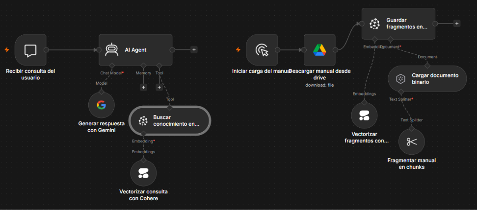
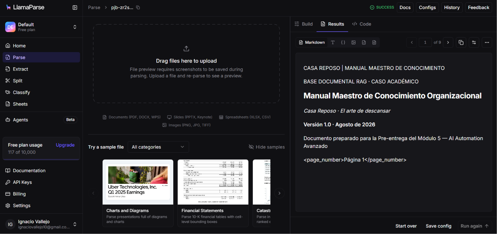
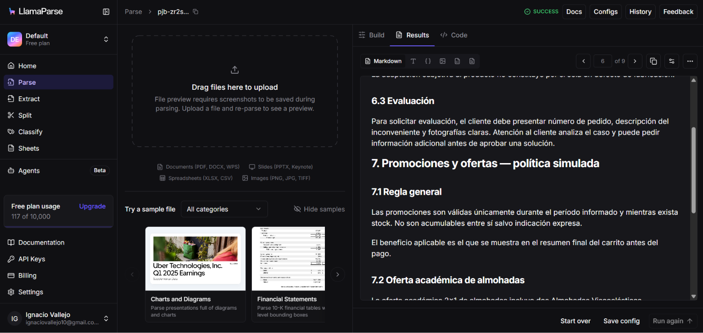
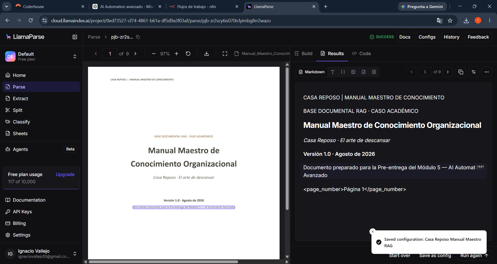
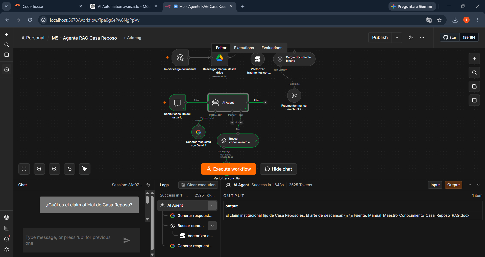
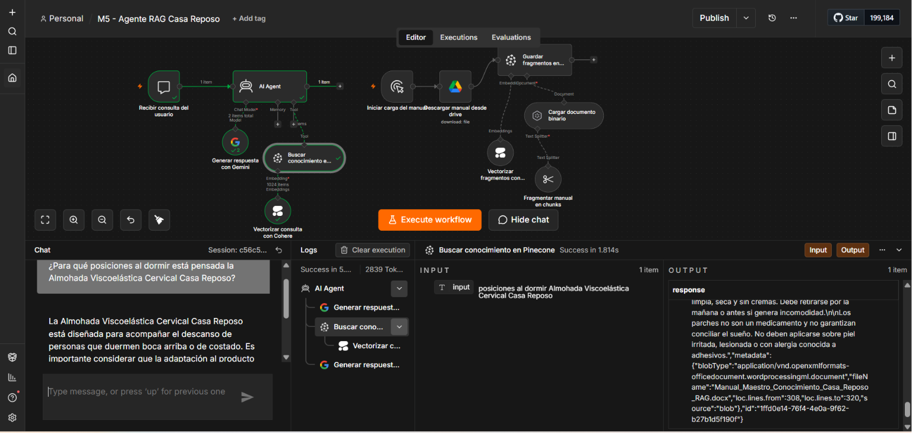
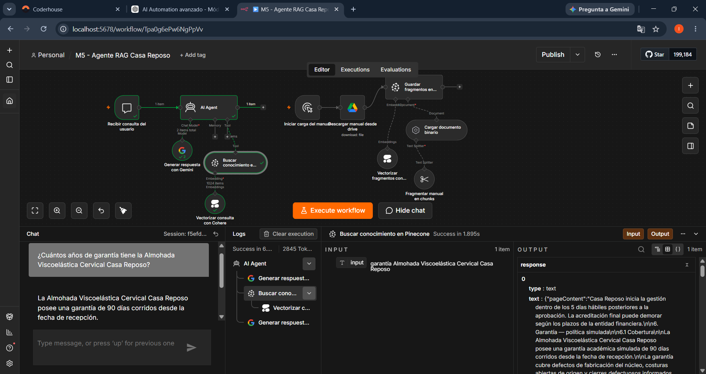
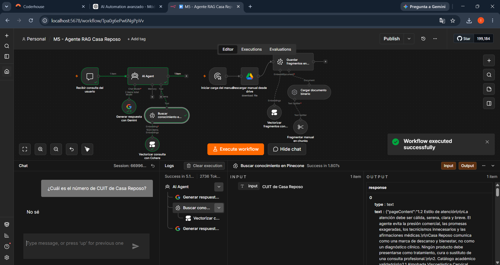
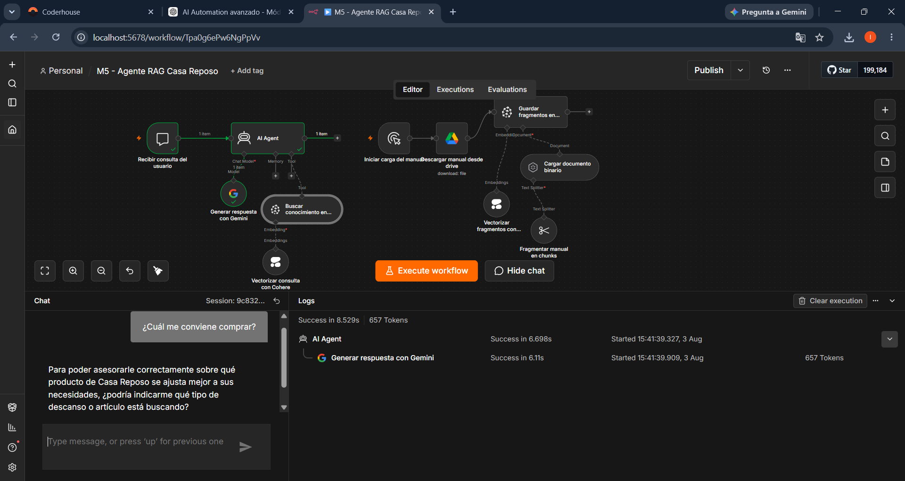

# Agente RAG para Casa Reposo

Proyecto desarrollado para el **Módulo 5 de AI Automation Avanzado de Coderhouse**.

El objetivo es implementar un agente conversacional con arquitectura **RAG (Retrieval-Augmented Generation)** capaz de consultar el Manual Maestro de Conocimiento de Casa Reposo, recuperar información relevante y generar respuestas confiables, trazables y respaldadas por la documentación disponible.

---

## Objetivo del proyecto

Construir en n8n un sistema de recuperación aumentada por generación que permita:

- Descargar el Manual Maestro desde Google Drive.
- Procesar el documento automáticamente.
- Dividir el contenido en fragmentos con superposición.
- Generar embeddings multilingües.
- Almacenar el conocimiento en Pinecone.
- Recuperar los fragmentos más relevantes ante cada consulta.
- Generar respuestas basadas exclusivamente en el manual.
- Citar el documento utilizado como fuente.
- Evitar alucinaciones cuando la información no está disponible.
- Solicitar aclaraciones cuando la consulta del usuario sea ambigua.

---

## Arquitectura de la solución

El workflow está organizado en dos circuitos independientes y complementarios.

### 1. Circuito de ingesta documental

```text
Disparador manual
        ↓
Descarga del Manual Maestro desde Google Drive
        ↓
Carga del documento binario
        ↓
Fragmentación mediante Recursive Character Text Splitter
        ↓
Generación de embeddings con Cohere
        ↓
Almacenamiento de vectores en Pinecone
```

Este circuito procesa el documento fuente, genera los vectores semánticos y almacena los fragmentos dentro del namespace:

```text
manual-maestro-v2
```

Cada fragmento incorpora el siguiente metadato documental:

```text
fileName = Manual_Maestro_Conocimiento_Casa_Reposo_RAG.docx
```

Esto permite que el agente identifique y cite correctamente el documento recuperado.

### 2. Circuito de consulta RAG

```text
Consulta del usuario
        ↓
AI Agent de Casa Reposo
        ↓
Vectorización de la consulta con Cohere
        ↓
Búsqueda semántica en Pinecone
        ↓
Recuperación de los cuatro fragmentos más relevantes
        ↓
Generación de la respuesta con Google Gemini
        ↓
Cita del documento recuperado
```

El agente utiliza Pinecone como herramienta de recuperación antes de generar la respuesta y trabaja sobre el mismo namespace y modelo de embeddings utilizados durante la ingesta.

---

## Tecnologías utilizadas

| Tecnología | Función |
|---|---|
| n8n | Orquestación del workflow |
| Google Drive | Almacenamiento y descarga del Manual Maestro |
| Default Data Loader | Lectura y preparación del documento binario |
| Recursive Character Text Splitter | División del documento en fragmentos |
| Cohere Embed Multilingual v3.0 | Generación de embeddings de 1024 dimensiones |
| Pinecone | Almacenamiento y recuperación vectorial |
| Google Gemini | Interpretación de contexto y generación de respuestas |
| LlamaParse | Análisis y validación externa de la estructura documental |
| GitHub | Documentación, versionado y entrega técnica |

---

## Validación externa con LlamaParse

Antes de completar las pruebas funcionales, el Manual Maestro fue analizado externamente mediante **LlamaParse**.

Esta etapa permitió:

- Verificar la correcta interpretación del documento.
- Inspeccionar el contenido extraído por página.
- Validar la conservación de títulos y secciones.
- Confirmar que el manual poseía una estructura adecuada para su procesamiento.

LlamaParse se utilizó como herramienta externa de análisis y validación documental. No forma parte del circuito final implementado dentro de n8n.

---

## Configuración técnica

### Fragmentación del documento

- **Chunk Size:** `1000`
- **Chunk Overlap:** `200`
- **Tipo de entrada:** `Binary`
- **Detección de formato:** automática mediante MIME Type
- **Método:** `Recursive Character Text Splitter`

El solapamiento permite conservar el contexto cuando una explicación queda dividida entre dos fragmentos consecutivos.

### Embeddings e índice vectorial

- **Proveedor:** Cohere
- **Modelo:** `Embed-Multilingual-v3.0`
- **Dimensiones:** `1024`
- **Índice de Pinecone:** `casa-reposo-rag`
- **Namespace:** `manual-maestro-v2`
- **Tipo de vector:** denso
- **Métrica de similitud:** coseno
- **Infraestructura:** serverless
- **Región:** AWS `us-east-1`

El mismo modelo de embeddings se utiliza durante la ingesta y durante la consulta para garantizar la compatibilidad dimensional.

El namespace `manual-maestro-v2` permite aislar la indexación final de versiones anteriores del documento y evita mezclar fragmentos pertenecientes a cargas diferentes.

### Metadatos documentales

Cada fragmento almacenado incorpora:

```text
fileName = Manual_Maestro_Conocimiento_Casa_Reposo_RAG.docx
```

El agente utiliza este metadato para construir la cita documental:

```text
Fuente: Manual_Maestro_Conocimiento_Casa_Reposo_RAG.docx
```

Los identificadores técnicos o genéricos, como `blob`, se ignoran y no se utilizan como fuente.

### Recuperación de conocimiento

- **Operación:** `Retrieve Documents (As Tool for AI Agent)`
- **Límite de resultados:** `4`
- **Namespace:** `manual-maestro-v2`
- **Metadata:** incluida
- **Reranking:** desactivado

El valor `Top-K = 4` mantiene un equilibrio entre relevancia y cantidad de contexto, evitando incorporar fragmentos innecesarios que puedan generar ruido en la respuesta.

---

## Funcionamiento del sistema

1. El workflow descarga el Manual Maestro desde Google Drive.
2. El archivo se procesa como documento binario.
3. El contenido se divide en fragmentos con superposición.
4. Cohere transforma cada fragmento en un vector de 1024 dimensiones.
5. Pinecone almacena los vectores dentro de `manual-maestro-v2`.
6. Cada fragmento conserva el metadato `fileName`.
7. El usuario realiza una consulta desde el chat.
8. El agente utiliza Pinecone como herramienta de recuperación.
9. Cohere vectoriza semánticamente la consulta.
10. Pinecone recupera los cuatro fragmentos más relevantes.
11. Gemini genera una respuesta basada en el contexto recuperado.
12. Cuando corresponde, el agente cita el nombre del documento.
13. Si la información no está respaldada por el manual, responde únicamente `No sé`.
14. Si la consulta es ambigua, solicita la aclaración mínima necesaria.

---

## Control de alucinaciones

El mensaje de sistema establece las siguientes reglas:

- Consultar la base de conocimiento antes de responder.
- Utilizar solamente información respaldada por el Manual Maestro.
- No completar datos faltantes con conocimientos externos.
- No inventar precios, políticas, características, direcciones ni procedimientos.
- No revelar detalles técnicos internos de la arquitectura RAG.
- Mantener un tono profesional, cálido y claro.
- Citar el documento mediante el metadato `fileName`.
- Ignorar identificadores técnicos como `blob`.
- Solicitar aclaraciones ante preguntas ambiguas.
- Reconocer expresamente cuando la información no está disponible.

Cuando los fragmentos recuperados no contienen información suficiente, la respuesta obligatoria es única y exactamente:

```text
No sé
```

En ese caso, el agente no agrega fuente, explicación, saludo, disculpa ni texto adicional.

---

## Pruebas funcionales realizadas

### Prueba 1: claim oficial de la marca

Se consultó al agente por el claim oficial de Casa Reposo.

El sistema recuperó la información correspondiente del Manual Maestro y respondió de manera coherente con la identidad de la marca.

### Prueba 2: posiciones recomendadas para dormir

Consulta realizada:

```text
¿Para qué posiciones al dormir está pensada la Almohada Viscoelástica Cervical Casa Reposo?
```

El agente indicó correctamente que está diseñada para personas que duermen:

- Boca arriba.
- De costado.

La respuesta incluyó la fuente documental:

```text
Fuente: Manual_Maestro_Conocimiento_Casa_Reposo_RAG.docx
```

### Prueba 3: garantía del producto

Se consultó cuántos años de garantía tenía la almohada.

El agente identificó que la garantía establecida en el manual es de:

```text
90 días corridos
```

La prueba permitió comprobar que el sistema prioriza la información recuperada y no presupone una garantía expresada en años.

### Prueba 4: información inexistente

Consulta realizada:

```text
¿Cuál es el número de CUIT de Casa Reposo?
```

Como el Manual Maestro no contiene ese dato, el agente respondió única y exactamente:

```text
No sé
```

No agregó una fuente ni inventó información.

### Prueba 5: consulta ambigua

Consulta realizada:

```text
¿Cuál me conviene comprar?
```

El agente no recomendó un producto de manera arbitraria. Solicitó información adicional para conocer la necesidad del usuario antes de responder.

Esta prueba valida el manejo responsable de consultas sin contexto suficiente.

---

## Resultados obtenidos

- Manual procesado correctamente.
- `17` fragmentos generados y almacenados.
- Embeddings multilingües de 1024 dimensiones.
- Namespace independiente configurado.
- Metadato documental incorporado.
- Recuperación semántica validada.
- Respuestas respaldadas por el Manual Maestro.
- Citas documentales corregidas.
- Control de alucinaciones validado.
- Gestión de consultas ambiguas validada.
- Workflow ejecutado sin errores.
- Arquitectura modular, reutilizable y adaptable a nuevos documentos.

---

## Evidencias

### 1. Arquitectura completa del workflow

Vista general de los circuitos de ingesta documental y consulta RAG.



### 2. Resultado documental en LlamaParse

Validación externa del contenido interpretado en la primera página.



### 3. Estructura documental en LlamaParse

Comprobación de la conservación de títulos, secciones y contenido estructurado.



### 4. Configuración guardada en LlamaParse

Evidencia de la etapa externa de análisis documental.



### 5. Prueba del claim oficial

Recuperación y respuesta basada en el Manual Maestro.



### 6. Prueba de posiciones para dormir

Respuesta correcta con cita del documento fuente.



### 7. Prueba de garantía

Recuperación correcta del período de garantía documentado.



### 8. Prueba de control de alucinaciones

Respuesta `No sé` ante una consulta cuyo dato no existe en el manual.



### 9. Prueba de consulta ambigua

Solicitud de aclaración antes de recomendar un producto.



---

## Estructura del repositorio

```text
coderhouse-ai-automation-avanzado-modulo-5/
├── README.md
├── M5_Agente_RAG_Casa_Reposo.json
└── evidencias/
    ├── README.md
    ├── 01_Arquitectura_Completa_Workflow_RAG.png
    ├── 02_LlamaParse_Resultado_Pagina1.png
    ├── 03_LlamaParse_Estructura_Pagina6.png
    ├── 04_LlamaParse_Configuracion_Guardada.png
    ├── 05_Prueba1_Claim_Respuesta_RAG.png
    ├── 06_Prueba2_Posiciones_Respuesta_RAG.png
    ├── 07_Prueba3_Garantia_Respuesta_RAG.png
    ├── 08_Prueba4_Control_Alucinaciones_No_Se.png
    └── 09_Prueba5_Consulta_Ambigua.png
```

---

## Importación del workflow

1. Descargar `M5_Agente_RAG_Casa_Reposo.json`.
2. Abrir n8n.
3. Seleccionar la opción para importar un workflow desde archivo.
4. Elegir el JSON descargado.
5. Configurar credenciales propias para:
   - Google Drive OAuth2.
   - Cohere.
   - Pinecone.
   - Google Gemini.
6. Seleccionar o crear un índice compatible con vectores de 1024 dimensiones.
7. Verificar el namespace `manual-maestro-v2`.
8. Configurar el documento correspondiente en Google Drive.
9. Ejecutar una sola vez el circuito de ingesta.
10. Probar posteriormente las consultas desde el chat.

> Las claves de API, tokens, contraseñas y demás secretos no están incluidos en el repositorio.

---

## Seguridad y credenciales

El workflow exportado no incluye claves privadas ni secretos en texto plano.

Para utilizarlo, cada persona debe configurar sus propias credenciales dentro de n8n. Las referencias a credenciales incluidas en el workflow no proporcionan acceso a las cuentas utilizadas durante el desarrollo.

---

## Archivo principal

El workflow completo y reutilizable está disponible en:

[M5_Agente_RAG_Casa_Reposo.json](./M5_Agente_RAG_Casa_Reposo.json)

---

## Autor

**Ignacio Vallejo**

Proyecto académico desarrollado para la carrera de **AI Automation Avanzado de Coderhouse**, aplicado a un caso real de gestión de conocimiento para Casa Reposo.
